# OpenFOAM_contents20

技術書典20 向けの OpenFOAM 共役熱伝達（CHT）解析ケースファイルです。  
書籍「OpenFOAM マルチリージョン熱流体解析」に対応しています。

---

## ケース一覧

### 001_snappyMultiRegionHeater

snappyHexMesh を用いた CHT 解析のチュートリアルケースです（OpenFOAM 公式チュートリアルを参考）。

- **ソルバー**: chtMultiRegionFoam
- **メッシュ**: snappyHexMesh
- **領域**: bottomAir / topAir / heater / leftSolid / rightSolid

```bash
cd 001_snappyMultiRegionHeater
./Allrun
```

---

### 002_Uthermal

平板を挟んだ2流体の共役熱伝達解析によって **U値（熱貫流率）** を数値的に算出するケースです。

- **ソルバー**: chtMultiRegionFoam
- **メッシュ**: blockMesh + topoSet
- **領域**: fluid_1 / solid_1 / fluid_2 / solid_2
- `ana001_base` : 計算実行前のベースケース
- `ana001_run` : 計算設定済みケース（物性値・境界条件設定済み）

```bash
cd 002_Uthermal/ana001_run
./Allrun
```

#### 温度分布アニメーション

| 温度分布 | 比較（fluid_1 / solid_1 / fluid_2） |
|:---:|:---:|
|  |  |

#### 計算結果

**界面熱流束の時刻歴（全界面まとめ）**

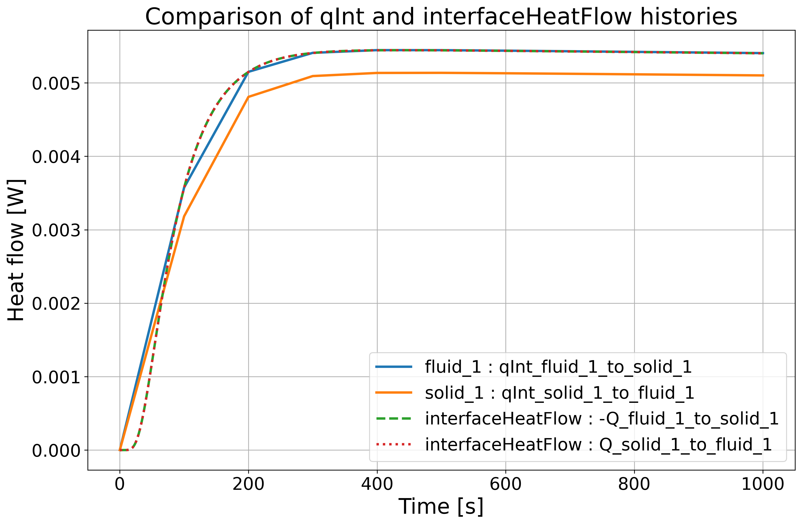

**界面熱流束（interfaceHeatFlow）**

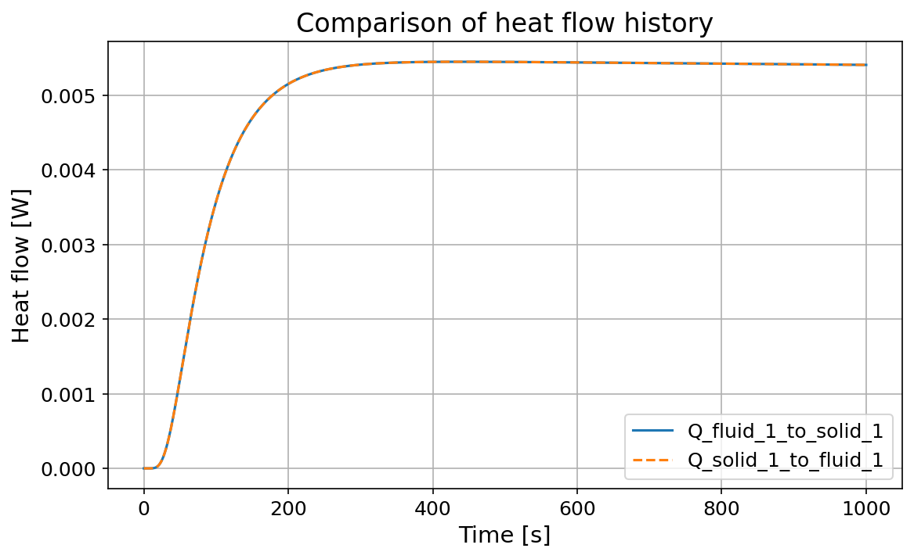

**面平均熱流束 qAvg（各界面）**

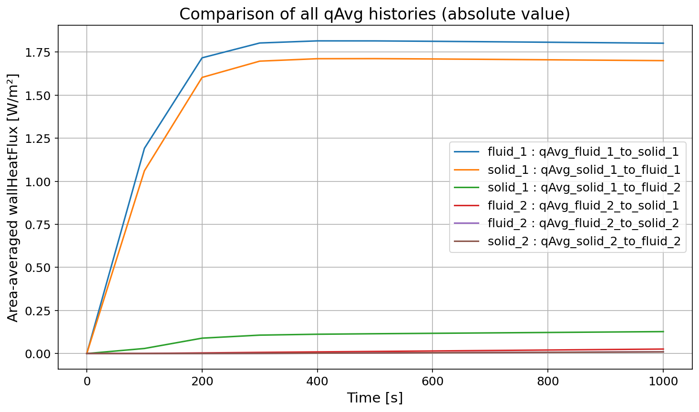

**面積分熱量 qInt（各界面）**

| 通常スケール | 自動スケール |
|:---:|:---:|
| 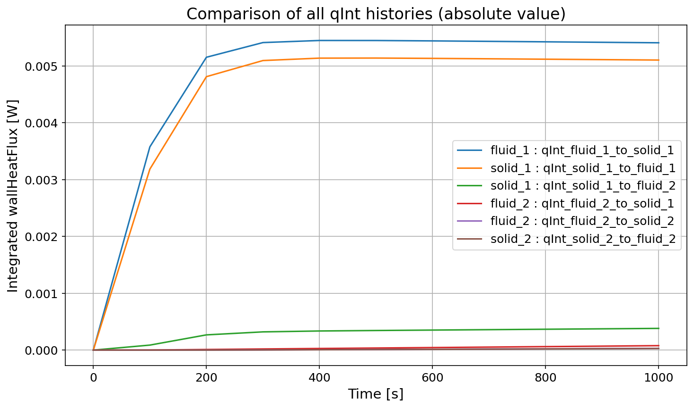 | 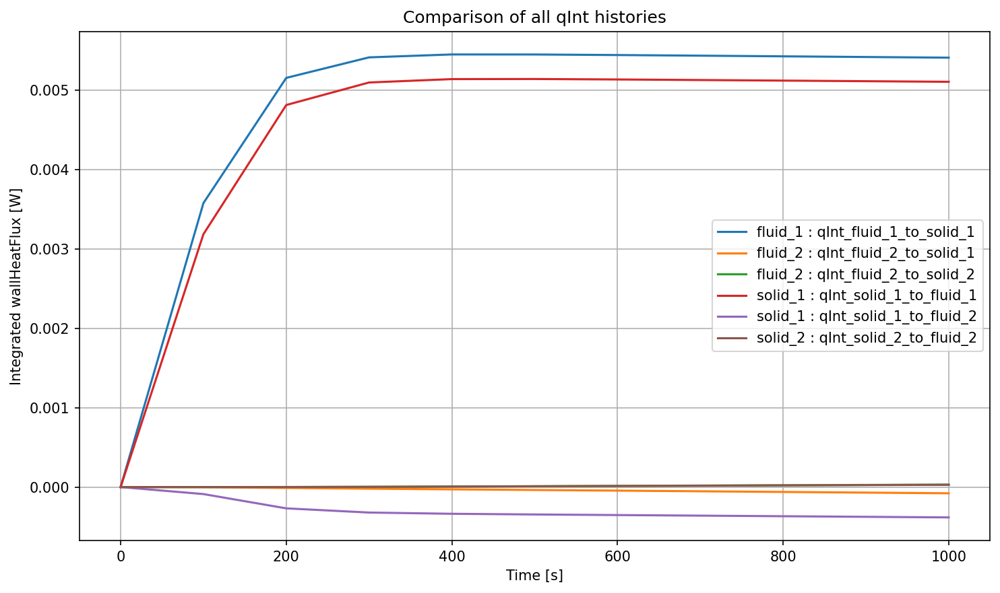 |

**残差履歴**

| fluid_1 | fluid_2 |
|:---:|:---:|
| 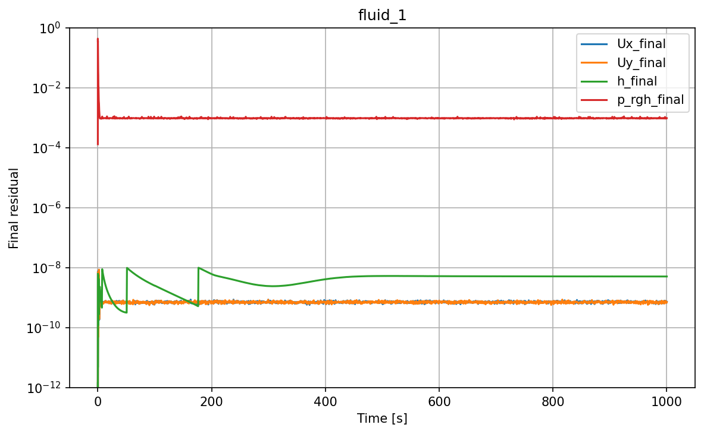 | 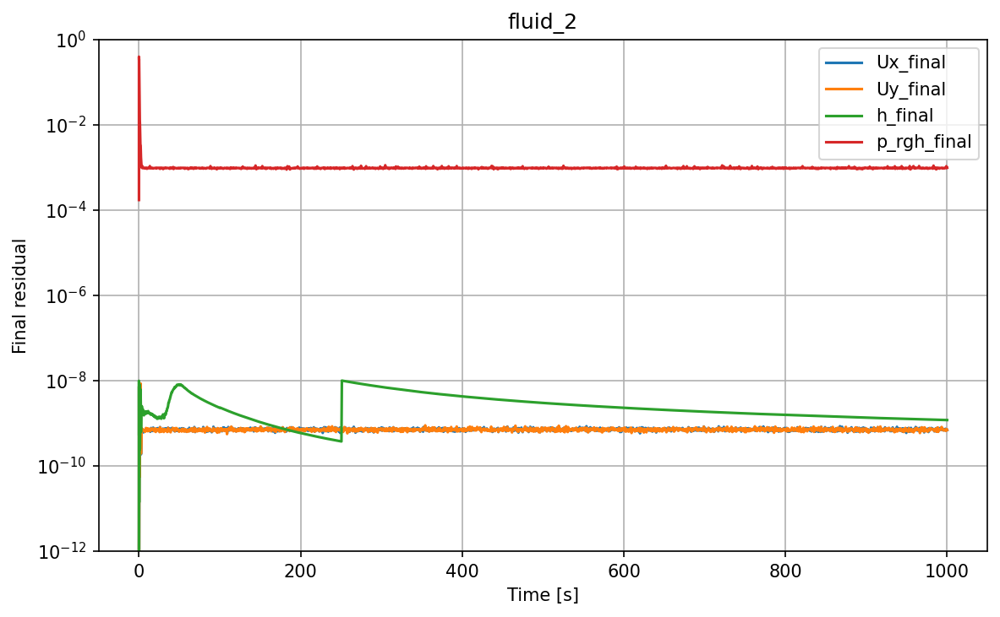 |

| solid_1 | solid_2 |
|:---:|:---:|
| 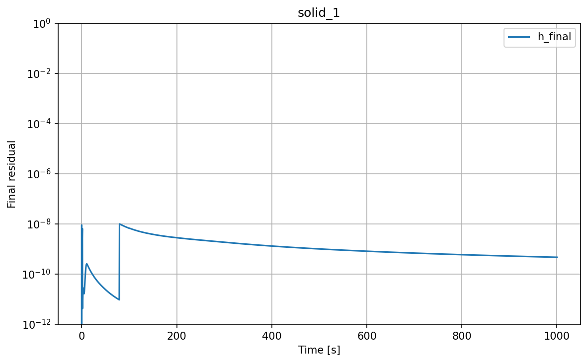 | 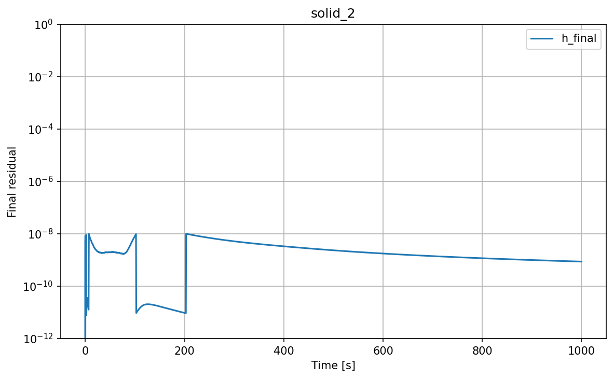 |

---

### 003_heatsink

アルミ製ヒートシンクを挟んだ2流体間の CHT 解析ケースです。  
ヒートシンクあり・なしの2ケースを比較して冷却効果を評価します。

- **ソルバー**: chtMultiRegionFoam
- **メッシュ**: snappyHexMesh
- **3D モデル**: FreeCAD (`model/model.FCStd`)
- `ana001_chtMultiRegionFoam` : ヒートシンクありケース
- `ana001_chtMultiRegionFoam_Noheatsink` : ヒートシンクなしケース

```bash
cd 003_heatsink/ana001_chtMultiRegionFoam
./Allrun
```

#### メッシュ（ParaView 確認）

| snappyHexMesh 結果（全体） | メッシュ断面詳細 |
|:---:|:---:|
| 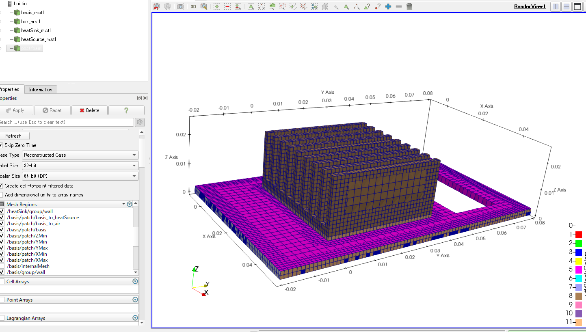 | 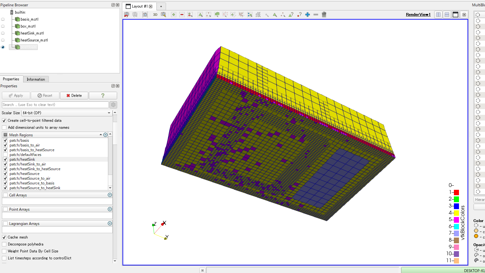 |

#### 温度分布アニメーション（ヒートシンクあり）


#### 計算結果

**界面平均温度の時刻歴**

| ヒートシンクあり | ヒートシンクなし |
|:---:|:---:|
| 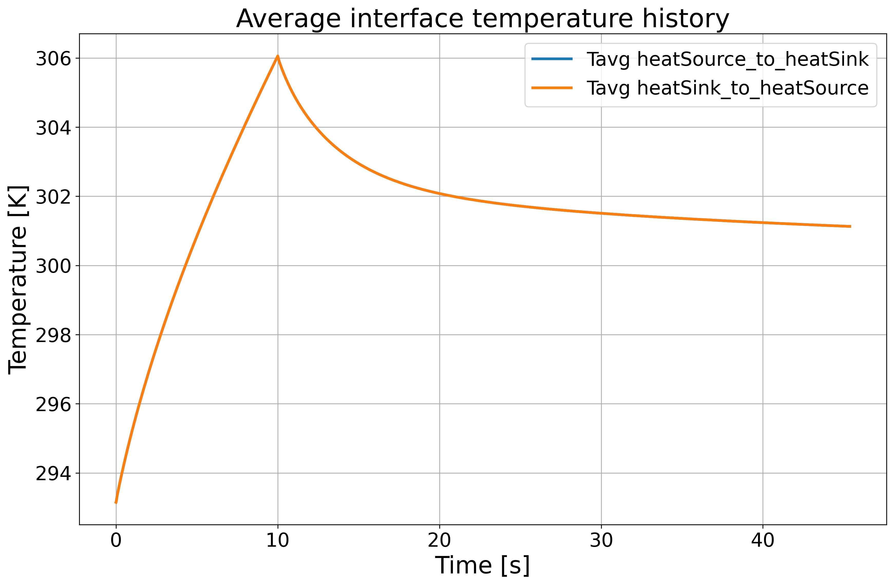 | 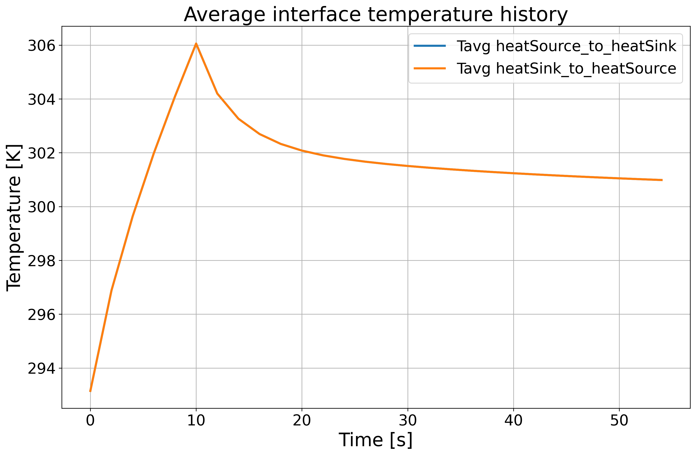 |

**界面平均温度の比較（あり vs なし）**

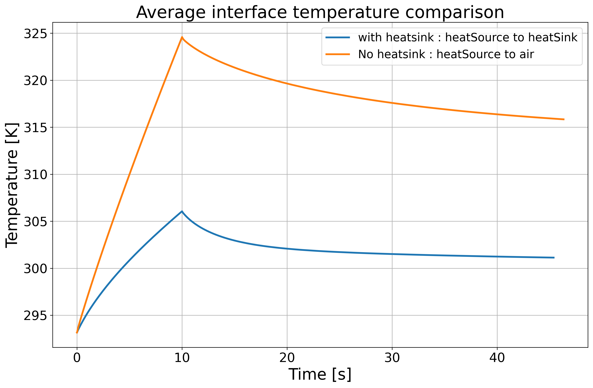

**界面熱流量の時刻歴**

| ヒートシンクあり | ヒートシンクなし |
|:---:|:---:|
| 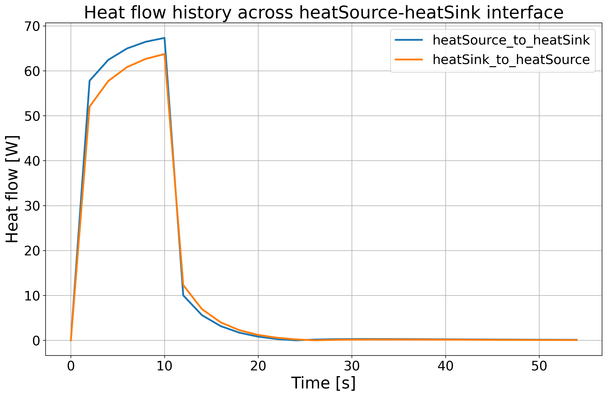 |  |

---

## 注意事項

- 計算結果（タイムステップディレクトリ、processor、postProcessing 等）はリポジトリに含まれていません
- 各自の環境で計算を実行してください
- 動作確認環境: OpenFOAM v2506（openfoam.com 版）

## ライセンス

本リポジトリの内容は技術書典20の書籍に関連するものです。  
書籍はこちらから購入できます: [OpenFOAM（自宅で深める 熱流体解析の基礎と応用）](https://takun-physics.net/downloads/%e3%80%90%e8%b3%bc%e5%85%a5%e5%8f%af%e8%83%bd%ef%bc%9a%e9%9b%bb%e5%ad%90%e6%9b%b8%e7%b1%8d%e3%80%91openfoam%ef%bc%88%e8%87%aa%e5%ae%85%e3%81%a7%e6%b7%b1%e3%82%81%e3%82%8b%e6%b5%81%e4%bd%93%e8%a7%a3/)
